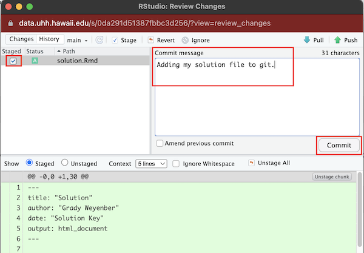

```{r include = F}
library(knitr) 
```

# Using R Markdown files

## Opening a new file

When you want to write a paper, you have to open a Word document to type your ideas into, and save your work in. In R we use a document type called an R Markdown document. R Markdown documents are useful for both running code, and annotating the code with comments. The document can be saved, so you can refer back to your code later, and can be used to create other document types (html, word, pdf, or slides) for presenting the results of your analyses. R Markdown provides a way to generate clear and reproducible statistical analyses. 

To open a new file, click on the little green plus on the upper left hand, and select R Markdown, as in the image below. You can leave it untitled. 


When you open a new R Markdown file, there is some example code in it that you can get rid of. We will take care of this next. 

## Make changes to a file

Let's make some changes to the R Markdown file you just opened. The shortcut `Ctrl-1` moves focus to the editor.

Using the image below as a guide

- First, change the title of the lab at the top to "Getting to know RStudio". Be sure to keep the quotation marks. 
- Second, add an author line, following the example below. You need quotation marks!
- Third, delete everything in the document from line 6 downwards.
- Fourth, add headers and text, **exactly** following the example below. 
- Finally, insert what is called a "code chunk." To do this you click on the **insert** button near the top center of the screen, then choose R. The greyed out box that shows up is where you type code. (`Ctrl-Alt-I` inserts a code chunk below the cursor.)

Your final result should look like this:


## Saving a file

You will complete your lab work in an R Markdown file like this each week, so it is important to learn how to save these files. 

-  Click File > Save As... (or the 💾 icon, or `Ctrl-S`)
-  Name the file: `PS01_solution` (use this exact filename)
-  Click save

This is now saved, and should appear as `PS01_solution.Rmd` in the Files pane in the lower right. 

## Knitting a file

Click the Knit button (`Ctrl-Shift-K`) at the top left side of the screen to "knit" the file, or in other words, produce an output document. An `.html` file will be generated. It is automatically saved in the same folder that your R Markdown file was saved in. 

::: {.license}
Note that there is now a R Markdown file (`.Rmd`) and an html file (`.html`) in the folder. There should also be a popup window showing the output `.html` file.
:::

Inspect the `.html` file to see how what you typed was formatted. There are lots of tricks for controlling the formatting of the knitted html file. For instance:

*  putting `##` and a space in front of text makes it into a large header. For example, see how `## This is a header` in your R Markdown `.Rmd` file translates in the resulting `.html` output.
*  putting `###` and a space in front of text makes it a smaller header!
*  RStudio now has a "visual markdown" editor mode which you can enable/disable using the protractor icon in the top right of the editor pane. Some people might like this mode.


# Entering and running commands

The code chunks are where you put R code in a R Markdown file. So far, your "knitted" file (your output document file) doesn't show anything, because we did not put any content in the code chunks yet! 

Using your first code chunk, type the following command to create a new variable called `x` with the value of 6. 

```{r}
x <- 6
```

The arrow `<-` is called an **ASSIGNMENT OPERATOR**, and tells R to save an object called `x` that has the value of 6. This is similar to saving a value in a graphing calculator. 

> Note that whatever you want to save must always be to the left of the assignment operator!!

To actually **RUN** this command in your console, you have a few options:

- click on the green triangle in the code chunk
- put the cursor on the line with the code and hit `Control-Enter` on a PC or `Command-Return` on a Mac

Think of "running" code in your console as telling R "do this".

::: {.license}
Note that you now have a new object in your workspace, called x!


:::

## Committing to Git 

When working on a document or project it is a very good idea to keep a record of specific versions. It is especially important to make a record of a particular draft before you make any major changes or additions. Keeping track of these versions and changes to all of the files in a project is called _version control_ is one of the main goals of the Git software. 

However, unlike cloud sync systems, you must explicitly tell Git exactly what you want it to remember, and when you want it to remember the current version. Nothing is automatic. 

The basic Git workflow is this:

- Make a change to one or more files in your project. (Save the changes.)
- Double-check that you like the change you made and that everything works.
- "Stage" all of the changes you want Git to remember.
- "Commit" the staged changes to the local git repository.
- You can "Revert" any changes you do not like to reset the file to it's old state.

To stage the changes you made, select the checkboxes to the left of the new Rmd and html output files in the Git pane of RStudio. (Shortcut for the Git pane is `Ctrl-F1`)

Once you have staged the two files, select "Commit". A new window will popup where you can have a final review of the changes. Write a short _commit message_ summarizing what you did, and press commit.


In the figure above, I am set up to commit my new solution Rmd and html files to git. There are also some changes made to the instructions html document, but by leaving the staging box unchecked I am choosing not to commit these changes to git at this time.

It is a good idea to make commits reasonably often, whenever you finish working on a particular issue or exercise. This will take some practice and effort to get the hang of, but it will pay off in the long run in recovering from mistakes and preventing lost work.

## Submitting Assignments (Pushing to Github)

The second goal of the Git and Github systems is to allow multiple copies of the project to be kept in several locations, and to allow the copies to be updated from each other (_distributed_ version control).

If you are working on a project cloned from another git repository, then you will eventually want to "push" your changes back and update the original source with your edits. This will be the mechanism by which you submit assignments in this course. 

As long as you don't try anything fancy with git, this should be a simple matter of using the "Push" button in the Git pane. (Number 4 in the previous figure.) If successful, any changes you pushed back should now appear on your github repository for the project.


# Data types- a brief intro

So far you have made a numeric variable `x`. There many other types of data objects you can make in R.

First, copy, paste and run the following command in a new code chunk to make a **character** called `favorite_movie`. Think of characters as text as opposed to numerical values. Note that I told R that this was a **character** by putting quotation marks around `Star_Wars`. 

```{r}
favorite_movie <- "Star_Wars"
```

Next, copy, paste and run the following command into a new code chunk. 

```{r}
v <- c(2, 4, 6)
```

This makes what is called a **vector**, which we have named `v`. It is a data object that has multiple elements of the same type. This vector contains three numbers, 2, 4, and 6. The `c()` function says to r to `concatenate` the values 2, 4, 6, into a single **vector**. Note in the Environment pane that your vector `v` contains numbers (listed as `num`). 

You can do math on a vector that contains numbers! For instance, copy, paste and run the following command into a new code chunk. This tells R to multiply each element of the vector `v` by 3. 

```{r eval = F}
v * 3
```


# Exercises

To complete this problem set you will next run through some Exercises, addressing each question and adding it to your `PS01_solution.Rmd` file. Please make a **header** for each of these Exercises. If you need to answer an Exercise with text, type the text **below** the header, on the next line, in the white part, and if you need to answer an Exercise with some code, insert a code chunk **below** the header, and put the code in the greyed out box. 

::: {.license}
Remember to save your work as you go along! Click the save button in the upper left hand corner of the R Markdown window. 
:::

1.  Answer the following with code in a code chunk (no text necessary). Remember that the code is just **instructions** for R. You need to run the code chunk to make R execute those instructions!
    -   Create a variable called `y` with the value of 7 
    -   Multiply `x` by `y`, and store the answer in a variable named `z` like so: `z <- x * y`
    -   You should now see `favorite_movie`, `x`, `v`, `y`, and `z` all in your Environment pane 
    
   
1.  - Run the following mathematical operation in a code chunk: `6 + 3` 
    - Where does the answer appear? (please answer with **text**)
    
1.  - Now add a code chunk, and save the results of `6 + 3` as a variable called `a`. 
    - Does the answer appear? (please answer with **text**)
    - Where does the object `a` show up? (please answer with **text**)
    - Next type `a` into the code chunk and re-run the code chunk. What happens? (please answer with **text**)


::: {.license}
It is a good idea to try kitting your document from time to time as you go along! Go ahead, and make sure your document is knitting, and that your html file includes Exercise headers, text, and code. Note that knitting automatically saves your Rmd file too!

If everything is looking good, you may also want to commit your current version to git.
:::


1.   - Run following command in a new code chunk. `a^2`. 
     - What does the `^` operator do? (please answer with **text**)

1.   - Type the following command into a new code chunk. `sum(a, x, y)` 
     - `sum` is a function. Based on the output, what do you think the `sum` function does? (please answer with **text**)

1.    - Click the little broom icon in the upper right hand corner of the **Environment** pane. Click yes on the window that opens. 
      - What happened? (please answer with **text**, and don't freak out)

1.   - Go to the **Run** button at the top right of the R Markdown pane, and choose **Run All** (the last option)
     - What happened? (please answer with **text**)
     
::: {.license}
It is a good idea to try kitting your document from time to time as you go along! Go ahead, and make sure your document is knitting, and that your html file includes Exercise headers, text, and code. Note that knitting automatically saves your Rmd file too!

If everything is looking good, you may also want to commit your current version to git. 

Don't forget to also push your git commits back to Github to make an independent backup.
:::
   
1.  Recall the vector `v` we created earlier. Copy, paste and run the following in a code chunk. What does this code accomplish? (please answer with **text**)
```{r eval = F}
v + 2
```

1.  Copy, paste, and run the following code to make a vector called `music`, that contains music genres. Recall a vector is a data object that has multiple elements of the same type. Here the data type is a **character**. Look in the environment pane. How does R tell us that this vector contains **characters**, not numbers? (please answer with **text**)

```{r}
music <- c("bluegrass", "funk", "folk")
```


1. Now let's practice some basic formatting. Using <a href="https://rmarkdown.rstudio.com/authoring_basics.html" target="_blank">this formatting tips page</a> figure out how to put the following into your lab report. These all can get typed into the white section, where text goes. **Hint:** To put  **each of these on its own line!** hit a hard return between each line of text!!!!!!!!


*Italicize like this*

**Bold like this**

A superscript: R^2^


1. Finally, Rmarkdown makes it easy to incorporate graphics into your documents. Commands which produce plots will have their images automatically inserted in the output document by Rmarkdown.

```{r eval=FALSE}
plot(faithful)
```


# Turning in your work

Once you have finished your submission do the following:

- Knit a final version of the assignment document.
- Stage and commit the final version of the Rmd and html files to git.
- Push the final commit back to Github

----

This repository is derived from the problem sets and labs for ModernDive by Jenny Smetzer, William Hopper, Albert Y. Kim, and Chester Ismay available at https://moderndive.com/labs


