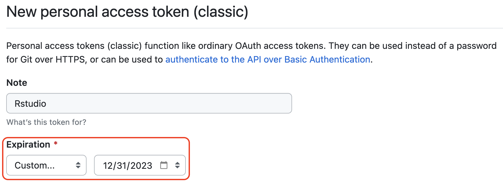
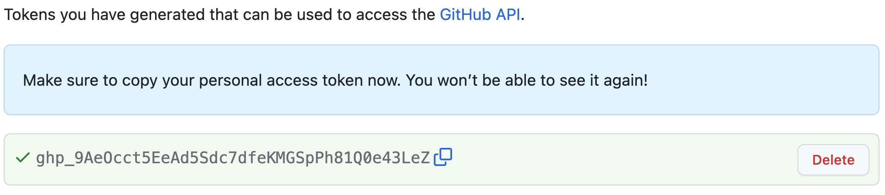
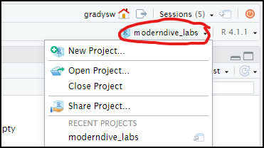
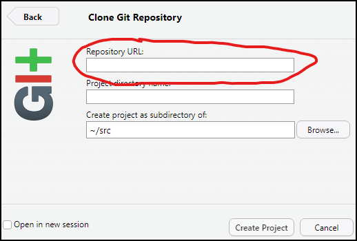

The goal this week is to introduce you to R and RStudio which you'll be using throughout the course both to review the statistical concepts discussed in the  course and to analyze real data and come to informed conclusions. To clarify which is which: R is the name of the programming language itself and RStudio is a convenient interface. 

Today we begin with the fundamental building blocks of R and RStudio: the interface, creating and saving files, and basic commands.

We will also introduce Git and Github, tools for managing and tracking changes in software projects. You will be submitting your work in this course through Github.

# Opening RStudio Server

Open the UH Hilo Rstudio server by using the link given in class, or the button in Laulima.

This system is managed by Prof. Weyenberg and runs on some elderly math department hardware. It could fail at any time, and there are no backups. Use this system at your own risk and be sure to keep regular backups.

There are some other options for using RStudio that you may also consider:

You can install and manage the software on your own computer. You will need to install both R from https://cran.r-project.org and Rstudio Desktop from https://www.rstudio.com/products/rstudio/. You will also need to install R packages yourself. This method of using the software keeps everything on your own computer and can be used offline.

A third option is to use https://rstudio.cloud/. This is a commercially hosted version of the RStudio server software, with a free tier of account. This is hosted in the cloud and is probably the easiest and safest option. However, the free account has a limit of 25 hours per month on it, which might not be enough. You can upgrade the free account to 75 hours per month for a $5/mo charge.


# The RStudio Interface

Whichever method you choose, once everything is set up/logged in you should see something like the image below.


The panel on the left is where the action happens. It's called the *console*.  Every time you launch RStudio, it will have the same text at the top of the  console telling you the version of R that you're running.

The panel in the upper right contains your *workspace*. This shows the variables and objects you define during your R session, and a history of the commands that you enter. 

Any plots that you generate will show up in the panel in the lower right corner.  This is also where you can browse your files, and access help files, and upload and download files. 

## Running commands in the console

You can directly enter R commands in the console and then press `Return` to run them. If you type something like `1 + 2` into the console and run it, R should respond with output that says `[1] 3`.

You can move keyboard focus to the Console with the shortcut `Ctrl-2`.  The shortcut `Alt-Shift-K` will bring up a list of other keyboard shortcuts available to you. Learning the common keyboard shortcuts can save you a lot of time in the long run. Plus, it makes a lot of people think you are a computer wizard.

A quick way to get help on a R command is to enter a `?` and then a command name into the console. Try entering `?sum` now. The lower-right pane should pop up with the help file for the `sum()` command.

# Github Setup

First, if you do not already have an account with Github.com, you should [create one](https://github.com/join){target="_blank"}. If you aready have a Github account, then you should [log in](https://github.com/login){target="_blank"}. If you are using a public or lab computer, it is best if you do this, and other steps on Github in a Private/Incognito browser tab.

The next few setup steps need to be done once per RStudio installation. The following commands should be entered into the R console

Setup your name and email address in git. Copy and paste the command below, entering your own details into the appropriate strings.
```
usethis::use_git_config(user.name = "Your Name", user.email = "your.email@example.com")
```

Next we generate an access token on Github that Rstudio will use to authenticate itself on your behalf. Either enter the R command in the console below, or visit [this link](https://github.com/settings/tokens/new?scopes=repo,user,gist,workflow&description=Rstudio){target="_blank"}.
```
usethis::create_github_token(description="Rstudio") 
```

On the access token creation page, you should change the expiration date from 30 days to a custom date at the end of the semester. Leave the rest of the settings as they are (you can modify the Note if you want), scroll to the bottom of the page and press the green _Generate Token_ button.

>   

One the next page, copy the secret access token in the green box to the clipboard by clicking on the double-box icon to the right of the secret text. Don't close this page until you have succesfully activated this code with Rstudio.

> 

Now store the secret token in Rstudio by entering the following command into the R console, and then paste your PAT secret from the previous step into the prompt box that opens in RStudio.

```r
credentials::set_github_pat()
```

If everything works you should get a message confirming that the access token has been set up succesfully.

## Cloning an assignment project

RStudio organizes work into "Projects", which are mostly just folders in the file system plus a few settings. You can create projects from scratch, but many of the assignments in this course will be "cloned" from a template on Github. 

- Find the link to a Github Classroom Assignment on Laulima. The first time you use one of these links you will need to pair your github account account to a name in the class roster. After that everything should be automatic. 
- Visit your new assignment repository, go to the green "Code" button and copy the clone URL by clicking the copy button next to it.


- Return to RStudio and open the project drop down menu in the top right and select New Project. You can also go to File > New Project.



- Select "Version Control", then "Git". Paste the Clone URL from the last step into the Repository URL area and click "Create Project".



You should now be set up with a new R project which is copied from the template on github. Everything should be configured for you to eventually submit your work back to github when you are finished.

----

This repository is derived from the problem sets and labs for ModernDive by Jenny Smetzer, William Hopper, Albert Y. Kim, and Chester Ismay available at https://moderndive.com/labs

